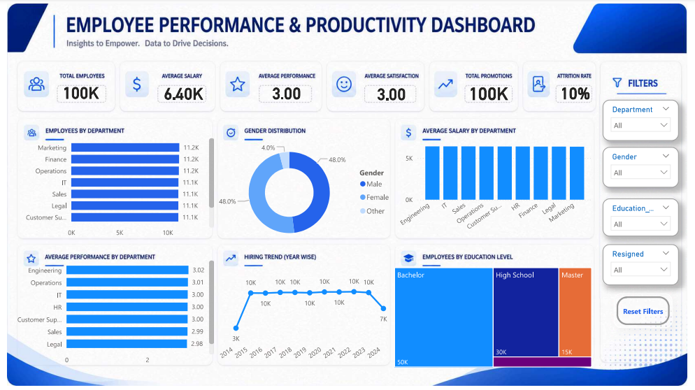

# Employee Performance & Productivity Analysis using SQL and Power BI

## 📌 Project Overview

This project analyzes employee performance and productivity using SQL and Microsoft Power BI. The analysis focuses on workforce distribution, salary trends, employee performance, promotions, hiring trends, overtime, satisfaction, and productivity to generate meaningful business insights.

The project demonstrates an end-to-end Data Analytics workflow including SQL data analysis, exploratory data analysis (EDA), advanced SQL concepts, and interactive dashboard development.

---

## 📂 Dataset Information

- **Dataset:** Employee Performance and Productivity
- **Source:** Kaggle
- **Records:** 100,000
- **Columns:** 20

---

## 🛠️ Tools Used

- MySQL Workbench 8.0
- Microsoft Power BI
- Microsoft Excel

---

## 📊 SQL Concepts Used

- Data Inspection
- Data Quality Check
- Exploratory Data Analysis (EDA)
- Aggregate Functions
- GROUP BY
- ORDER BY
- CASE Statements
- Date Functions
- Common Table Expressions (CTEs)
- Window Functions
  - ROW_NUMBER()
  - RANK()
  - DENSE_RANK()
  - LEAD()
  - LAG()
  - NTILE()

---

## 📈 Power BI Dashboard

The interactive dashboard includes:

- KPI Cards
- Department-wise Employee Distribution
- Gender Distribution
- Average Salary by Department
- Performance Analysis
- Hiring Trend
- Education Level Distribution
- Interactive Filters

### Dashboard Preview



---

## 💡 Key Business Insights

- Employee distribution varies across departments.
- Average salary remains nearly consistent across departments.
- Employee performance and satisfaction scores remain stable.
- Hiring trends can be analyzed across multiple years.
- Bachelor's degree holders represent the largest employee group.
- Interactive filters improve HR decision-making.

---

## 📁 Repository Structure

```
Employee-Performance-Productivity-Analysis
│
├── Employee_Performance_Productivity_Analysis_Report.pdf
├── Employee_SQL_main.sql
├── employee_PBI.pbix
├── Dashboard_SS.png
├── Extended_Employee_Performance_and_Productivity_Data.csv
└── README.md
```

---

## 📄 Project Report

The detailed project report is available in this repository.

---

## 👨‍💻 Author

**Roshan Kumar**

M.Sc. Statistics & Computing  
Banaras Hindu University
